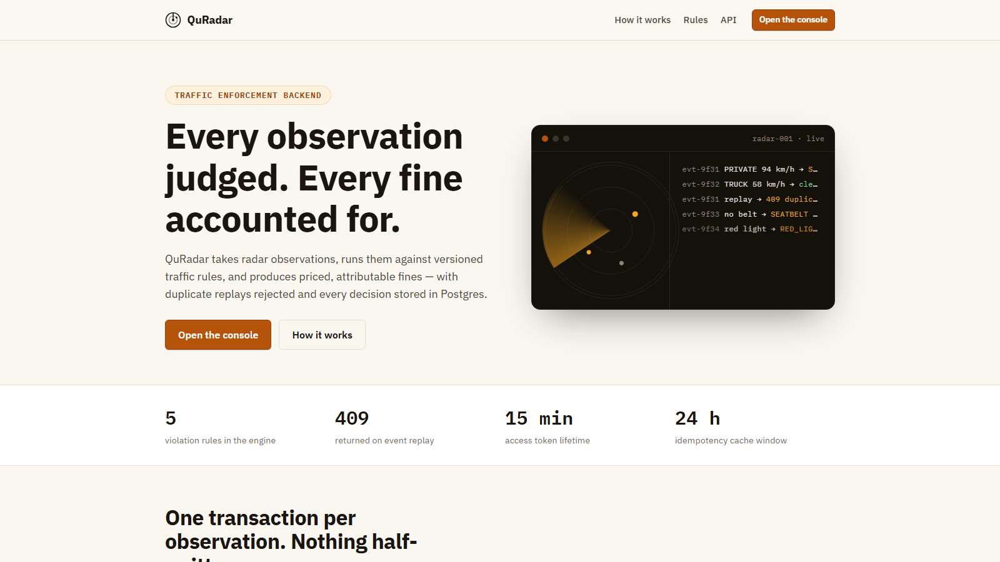
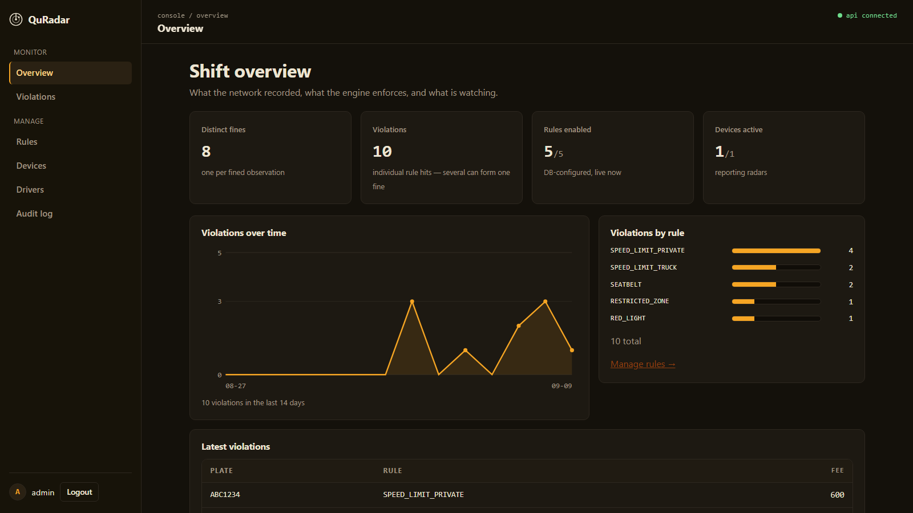
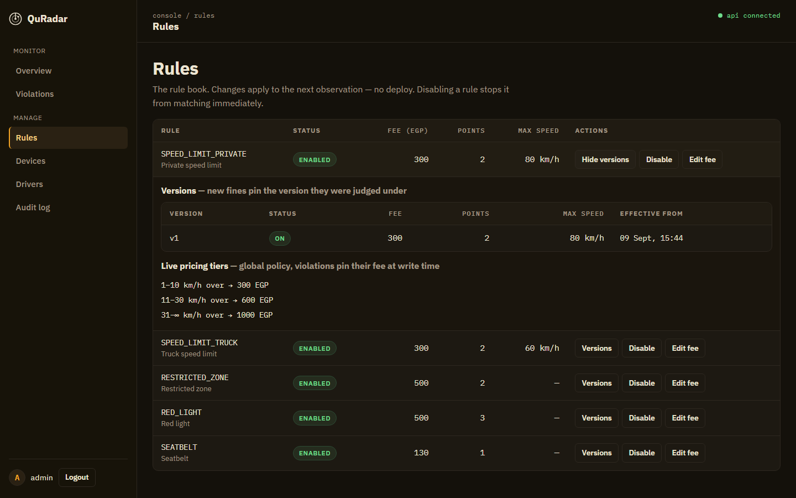
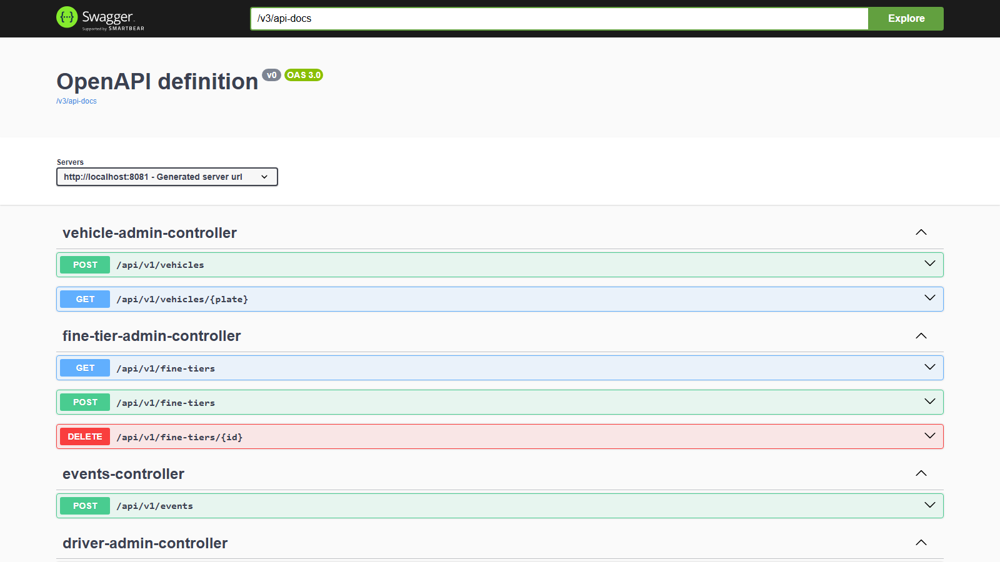
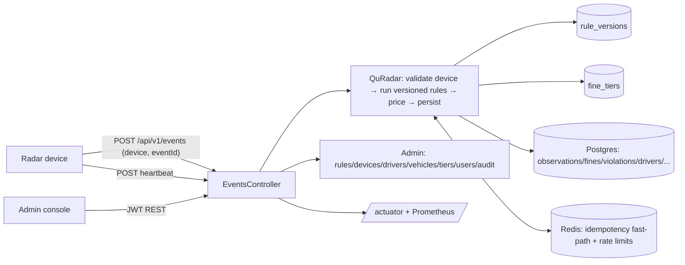
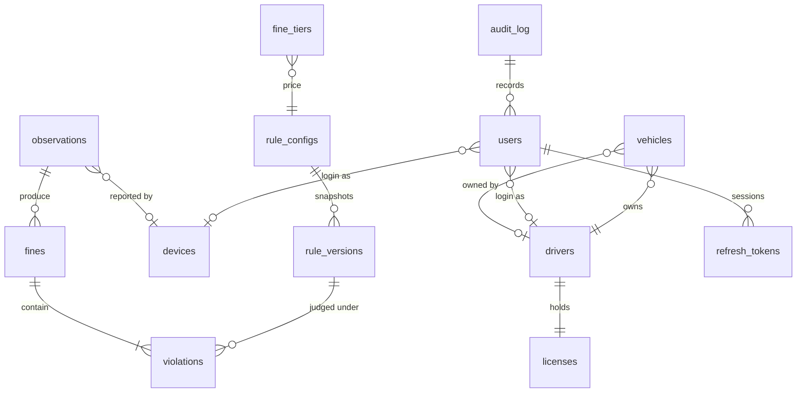

# Quantum Radar (QuRadar)

Traffic radar backend: radar devices submit `Observation`s, a DB-configurable rules
engine evaluates them, and the service persists violations + tiered fines + driver
penalty points. Single Spring Boot modular monolith — no microservices.






```bash
# one-command local run from backend/ (monorepo: UI lives in ../frontend)
docker compose up --build
# backend :8080 · admin UI :5173 · postgres :5432 · redis :6379
```

Local dev without Docker: `mvn spring-boot:run` (needs Postgres + Redis; override
with `SPRING_DATASOURCE_URL`, `REDIS_HOST`/`REDIS_PORT` — e.g. ports `5433`/`6380`
if yours are taken). Bootstrap admin: `admin` / `ADMIN_PASSWORD` (default
`admin123`, warned at startup). API docs: `/swagger-ui.html`.

## Architecture



Packages: `ingestion/` (intake API) · `rules/` (engine + config) ·
`violation/` · `fine/` (calc + queries) · `vehicle/` · `driver/` ·
`device/` (registry) · `security/` (JWT/roles) · `common/` · `config/`.

## Data model



Migrations are strictly forward-only (`V1` observations/fines/violations →
`V2` rule configs → `V3` signals → `V4` devices+eventId → `V5`
driver/license/vehicle/tiers → `V6` users/tokens → `V7` audit log →
`V8` rule versions → `V9` device health → `V10` composite event idempotency +
CHECKs). Applied files are frozen.

## API reference

| Method | Path | Role | Notes |
|---|---|---|---|
| POST | `/api/v1/auth/login` | public | → access (15m) + refresh (7d) JWT |
| POST | `/api/v1/auth/refresh` | public | rotates: old token revoked |
| POST | `/api/v1/auth/logout` | public | revokes refresh token, always 204 |
| POST | `/api/v1/events` | DEVICE (own) / ADMIN | 201 fine, 204 clean, 409 replay, 404 device |
| GET/PATCH | `/api/v1/rules[/{code}]` | ADMIN | enable, edit fee/points/maxSpeed (snapshots a version) |
| GET | `/api/v1/rules/{code}/versions` | ADMIN | version history with effective-from |
| GET/POST/PATCH | `/api/v1/devices[/{code}]` | ADMIN (+OFFICER read detail) | registry, health, last seen, event counts |
| POST | `/api/v1/devices/{code}/heartbeat` | DEVICE (own) / ADMIN | bumps last-seen, firmware, IP |
| POST / GET | `/api/v1/drivers` | ADMIN / ADMIN+OFFICER+own CITIZEN | lookup by licenseNo |
| GET | `/api/v1/drivers/{licenseNo}/summary` | ADMIN+OFFICER+own CITIZEN | identity, vehicles, violation/fine totals |
| POST / GET | `/api/v1/vehicles` | ADMIN / +history scoped | register, history with fines |
| GET | `/api/v1/fines?plate=&page=&size=` | ADMIN/OFFICER/own CITIZEN | paginated |
| GET | `/api/v1/violations?plate=&rule=&device=&from=&to=&minFee=&maxFee=&page=` | ADMIN/OFFICER/own CITIZEN | filtered search, paginated |
| GET | `/api/v1/violations/stats/daily?days=` + `/by-rule` | ADMIN/OFFICER | trend + distribution aggregates |
| GET/POST/DELETE | `/api/v1/fine-tiers` | ADMIN | tiered pricing |
| GET/POST | `/api/v1/admin/users` | ADMIN | create logins (CITIZEN↔driver, DEVICE↔device) |
| GET | `/api/v1/audit?page=&size=` | ADMIN/OFFICER | who changed what, from→to, IP |
| GET | `/actuator/health|info` | public | liveness |
| GET | `/actuator/metrics|prometheus` | ADMIN (auth) | counters, timers, histograms |

Auth: BCrypt passwords, JWT access + rotating refresh (SHA-256 hashes stored
server-side), stateless filter, `@PreAuthorize` + `SecuritySupport` ownership
checks. Ownership is resolved from the JWT identity against the DB — client
fields are never trusted (DEVICE posting another device's code → 403,
CITIZEN reading another plate → 403).

## Trade-offs you can defend

**Idempotency without Kafka.** Scope is `(device_id, event_id)` — two radars may
legitimately share a local sequence number, while a replay from the same device
fails closed with 409. Enforced by a composite DB UNIQUE constraint (NULL-device
history rows stay distinct under Postgres NULL semantics) plus CHECKs on license
status and non-negative money. An outbox + broker would add throughput and async
retries at the cost of a broker, consumer lag, and exactly-once plumbing nobody
here needs yet. Redis (`idem:event:{device}:{event}`, 24h TTL, written after
commit) is only a fast-path 409; on misses or outages the constraint decides —
proven live by replaying with the DB row deleted.

**Concurrency without distributed locks.** `@Version` on `Driver` (points) and
`FineEntity` (totals): two violations for one driver racing → one commits, the
loser gets `OptimisticLockingFailureException` and retries. Correct because
contention is rare; a pessimistic lock or queue would serialize all ingestion
for no benefit. Covered by `OptimisticLockingIT`.

**Sync processing.** Validate → rules → fine → persist in one transaction keeps
the demo truthful and the failure modes obvious (409/422/5xx right in the
response). It caps throughput — that is an explicit v3 problem (async pipeline).

**Rules in the DB, versioned.** Thresholds/fees/points/enabled are rows, not code:
every tuning snapshots a new `rule_versions` row, the engine evaluates the latest
effective version, and each violation pins the version it was judged under — old
fines never move. Tiers stay a global live policy because violations already pin
their computed fee+points at write time. New rule = new `ViolationRule` POJO +
`toRule` case + seed row + unit test (each rule has zero Spring imports).

**Health derived, not stored.** Device ACTIVE/DEGRADED/OFFLINE comes from
last-seen age (heartbeats + accepted events bump it), so it can never go stale;
thresholds are configurable.

**Audit everything admins touch.** Explicit service calls (not triggers) record
actor/action/entity/from→to/IP — portable, testable, visible in the console.

**Observability.** Actuator + Prometheus with domain counters
(`events.received/rejected`, `violations/fines.created`) and a rule-evaluation
timer; p95 via `histogram_quantile` over the exported buckets. Health is public,
metrics need ADMIN.

## Testing

- `mvn test` — 27 unit/slice tests (every rule, tier math, builder filtering, controller slice).
- `mvn verify` — Testcontainers suites (`*IT`, failsafe): ingestion
  201/409/404/400/401 + cross-device ids + stats, auth rotation/logout, version
  snapshots + pinning, heartbeat health, optimistic-locking conflict, Redis
  cache-served 409, actuator exposure. Needs Docker;
  on Windows + Docker Desktop 29 set `DOCKER_HOST=npipe:////./pipe/dockerDesktopLinuxEngine`.
- CI runs `mvn -B verify` + a Docker build check on every push/PR
  (`.github/workflows/backend.yml`, path-filtered).

## Configuration

| Var | Default | Purpose |
|---|---|---|
| `SPRING_DATASOURCE_URL/USERNAME/PASSWORD` | `localhost:5432/quradar` | Postgres |
| `REDIS_HOST/PORT` | `localhost:6379` | Redis (cache only) |
| `JWT_SECRET` | dev default | HS256 key (≥32 bytes), rotate in prod |
| `ADMIN_USERNAME/PASSWORD` | `admin/admin123` | bootstrap admin if users empty |
| `RATELIMIT_EVENTS_PER_MIN/AUTH_PER_MIN` | `60/10` | Redis fixed-window limits, fail-open |

`DemoRunner` replays the original 4-observation scenario on boot (fresh UUID
eventIds, `quradar.demo.enabled=false` in tests); REST ingestion is the real path.

## Future work (v3, deliberate — not started)

Dispute/review workflow for violations · scheduled (future-effective) rule versions ·
Kafka + transactional outbox for async ingestion · PostGIS zone queries ·
WebSocket/SSE live violation feed · per-driver fine statements/PDF.
